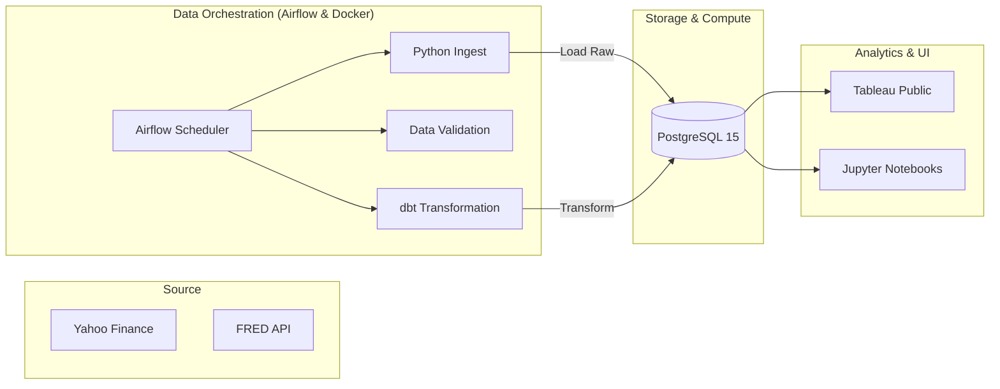

# Quant Risk Desk: Automated Portfolio Intelligence Pipeline

[]()
[](https://opensource.org/licenses/MIT)

An end-to-end financial engineering platform that automates the ingestion, validation, analysis, and visualization of sector-level market risk. This project demonstrates a production-grade analytics stack built to identify "Black Swan" correlation events and macroeconomic regime shifts across the S&P 500.

---

## 📊 The Core Thesis: "Diversification Evaporation"
The primary quantitative insight of this project is the mathematical proof of **Correlation Breakdown**. By calculating rolling 63-day pairwise correlations across 11 sectors, the system visualizes how sector diversification (avg. 0.47) violently collapses toward 1.00 (avg. 0.89) during systemic shocks like the March 2020 COVID crisis.

---

## 🏗️ Architecture & Technology Stack



### The Stack:
| Layer | Technologies |
|---|---|
| **Data Source** | `yfinance`, `fredapi` |
| **Ingestion & Validation** | `Python (pandas, SQLAlchemy)`, `Pydantic` |
| **Data Warehouse** | `PostgreSQL 15` |
| **Analytics Engineering** | `dbt (Data Build Tool)` |
| **Orchestration** | `Apache Airflow` |
| **Visualization** | `Tableau Public`, `Seaborn`, `Matplotlib` |
| **Infrastructure** | `Docker`, `Docker-Compose` |

---

## 📈 Quantitative Features
- **Rolling Risk Metrics**: Annualized Volatility, 252-day Sharpe & Sortino Ratios.
- **Systemic Sensitivity**: Rolling 1-year Beta calculated via covariance matrices against the S&P 500.
- **Tail Risk Engine**: Historical Simulation VaR (95% & 99%) and Conditional VaR (Expected Shortfall).
- **Macro Regime Engine**: Automated daily labeling of market regimes (Risk-On, Risk-Off, Inflation Shock, Recession) using Fed Rates, VIX, and CPI data.
- **Crisis Analytics**: "Underwater" drawdown tracking from 1-year ATHs.

---

## 🚀 Getting Started

### Prerequisites
- Docker & Docker Compose
- Yahoo Finance & FRED API Keys (Free)

### Installation
1. **Clone & Setup Environment**:
   ```bash
   cp .env.example .env
   # Add your FRED_API_KEY to the .env
   ```

2. **Launch Infrastructure**:
   ```bash
   docker compose up -d
   ```

3. **Access the Desk**:
   - **Airflow UI**: `http://localhost:8080` (admin/admin)
   - **pgAdmin**: `http://localhost:5050` (admin@riskdesk.com/admin)
   - **Local Database**: `localhost:5433`

4. **Trigger the Pipeline**:
   Enable and trigger the `financial_risk_pipeline` DAG in the Airflow UI.

---

## 📂 Repository Structure
```text
├── airflow/            # DAG definitions and Airflow config
├── dbt_project/        # dbt models (Staging, Intermediate, Marts)
├── data/               # Raw and processed data storage (Gitignored)
├── notebooks/          # Jupyter analysis for Quant research
├── scripts/            # Utility for data export and sanity checks
├── src/
│   ├── ingest/         # API retrieval scripts
│   └── validate/       # Data quality gates
└── docker-compose.yml  # Full-stack container orchestration
```

---

## 👤 Contact & Contribution
Created by **[Your Name]**.  
Feel free to reach out via [LinkedIn](https://linkedin.com) or [Email](mailto:example@email.com) for collaboration!

---
> [!NOTE]
> *This documentation is intended for portfolio demonstration and does not constitute financial advice.*
